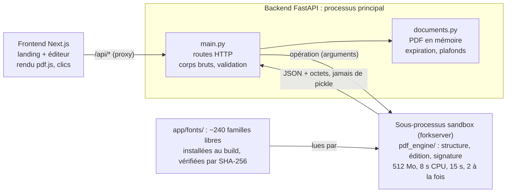

# Glyph — Document technique

Point d'entrée pour reprendre le projet ou le forker. Il résume l'état du projet et renvoie vers [`ARCHITECTURE.md`](./ARCHITECTURE.md), [`API.md`](./API.md) et surtout [`DECISIONS.md`](./DECISIONS.md), qui raconte le vrai bug derrière chaque choix non évident du moteur.

Dernière mise à jour : octobre 2026.

## Vue d'ensemble

Glyph est un éditeur PDF open source (licence MIT) qui modifie vraiment le texte d'un PDF. Les glyphes d'origine sont supprimés du flux du document par redaction PyMuPDF, puis le nouveau texte est réinséré à la même position. Les éditeurs classiques posent un rectangle blanc par-dessus et écrivent au-dessus, ce qui laisse l'ancien texte cherchable et copiable dessous.

Le projet tient en deux services :

- un frontend Next.js 16 (rendu pdf.js, clic sur une ligne, édition sur place) ;
- un backend FastAPI + PyMuPDF, qui fait tout le travail sur le PDF.

Pas de compte, pas de base de données, pas de stockage : chaque document vit en mémoire le temps de la session.

**Fonctionnalités en place :**

- édition ligne par ligne, avec la police d'origine quand elle est réutilisable, sinon la même famille depuis un catalogue d'environ 240 polices libres, ou un clone aux mêmes métriques ;
- préservation du formatage mixte : un mot en gras au milieu d'une phrase garde son gras si l'édition ne le touche pas ;
- signature dessinée ou importée (PDF en vectoriel, PNG ou JPEG), placée et redimensionnée à la main ;
- annuler / rétablir (historique côté serveur) et téléchargement du résultat ;
- site en français et en anglais : langue choisie selon le pays à la première visite, bouton FR/EN mémorisé ;
- landing page avec FAQ, données structurées SEO et lien Buy Me a Coffee.

## Démarrage rapide

Il faut Python 3.12 et Node.js (npm). Deux terminaux : le backend sur le port 8000, le frontend sur le port 3000, qui relaie `/api/*` vers le backend.

**Backend :**

```bash
cd backend
python3 -m venv .venv
.venv/bin/pip install -r requirements.txt
.venv/bin/python scripts/fetch_fonts.py      # une fois : ~95 Mo de polices, vérifiées par SHA-256
.venv/bin/python -m uvicorn app.main:app --port 8000 --reload
```

**Frontend :**

```bash
npm install
npm run dev
```

L'éditeur est sur <http://localhost:3000/editor>, la landing page sur <http://localhost:3000> (version anglaise : `/en` et `/en/editor`).

**Tests :**

```bash
cd backend && .venv/bin/python -m unittest discover -s tests -v   # 53 tests, ~3 s
npx tsc --noEmit && npm run build                                  # côté frontend
```

Sans `fetch_fonts.py`, tout fonctionne quand même. Le moteur se rabat sur Liberation et Open Sans, les seules polices commitées, et les tests qui ont besoin d'une famille téléchargée sont marqués `skip`.

## Architecture

Le frontend ne fait que l'affichage et l'interaction. Toute opération sur le PDF passe par le backend, et dans le backend par un sous-processus isolé. Le navigateur ne parle qu'au frontend : Next.js relaie `/api/*` vers `BACKEND_URL` (`next.config.ts`), donc pas de CORS à gérer en usage normal.



Le processus API ne lit jamais un PDF lui-même : il transmet les octets à un sous-processus jetable et ne récupère que du JSON et des octets bruts.

**Cycle de vie d'une édition :**

1. Upload : le PDF part en corps brut. Le backend le valide dans la sandbox et le garde en mémoire sous un `document_id` (UUID4).
2. Rendu : le frontend récupère les octets et dessine la page avec pdf.js.
3. Structure : le backend extrait les blocs de texte de la page (bloc, ligne, span avec police, taille, couleur). Le frontend les superpose en zones cliquables.
4. Édition : un clic ouvre une zone de saisie sur la ligne. À l'enregistrement, le backend supprime les glyphes d'origine, réinsère le nouveau texte, puis empile la nouvelle version dans l'historique.
5. Le frontend recharge la page et la structure, puisque les identifiants de bloc sont recalculés à chaque appel.
6. Téléchargement, ou suppression du document quand l'onglet se ferme.

**Carte des fichiers :**

| Fichier | Rôle |
| --- | --- |
| `proxy.ts` | Choix de la langue : préfixe `/en`, pays à la première visite, cookie |
| `lib/i18n/` | Dictionnaires `fr.ts` / `en.ts`, configuration des langues, balises `hreflang` |
| `app/[lang]/page.tsx` | Landing page, générée en français et en anglais (SEO, FAQ, Buy Me a Coffee) |
| `app/[lang]/editor/page.tsx` + `components/EditorApp.tsx` | Écran d'édition : upload, pages, undo/redo, signature, téléchargement |
| `components/PdfPage.tsx` | Rendu pdf.js, zones cliquables, zone de saisie |
| `components/SignatureModal.tsx`, `SignaturePlacer.tsx` | Capture puis placement de la signature |
| `lib/api-client.ts` | Tous les appels au backend, typés |
| `lib/brand.ts` | Le logo : un « G » en Rozha One (OFL) converti en tracés, source unique de l'en-tête, de l'icône iPhone et de l'image de partage ; `app/icon.svg` en reprend le tracé |
| `backend/app/main.py` | Routes FastAPI, lecture des corps bruts, validation des résultats de la sandbox |
| `backend/app/isolation.py` | Sandbox : un sous-processus par opération, limites, protocole sans pickle |
| `backend/app/documents.py` | Store en mémoire, historique, expiration et plafonds |
| `backend/app/pdf_engine/` | Le moteur d'édition (section suivante) |
| `backend/app/fonts/` + `backend/scripts/` | Polices embarquées, script de téléchargement et verrou d'empreintes |
| `backend/tests/` | Tests du moteur et des protections |

## Langues

Le site existe en français et en anglais, avec des URL distinctes pour que les deux versions soient référencées : le français sur `/` et `/editor`, l'anglais sur `/en` et `/en/editor`. En interne, toutes les pages vivent sous `app/[lang]` ; `proxy.ts` (le nouveau nom du middleware depuis Next 16) réécrit les URL françaises vers `/fr/...`.

**Choix de la langue, pour une URL sans préfixe :**

1. le cookie `glyph-lang`, posé par le bouton FR/EN, gagne toujours ;
2. un robot d'indexation n'est jamais redirigé : il voit la version demandée ;
3. sinon, le pays donné par Vercel (`x-vercel-ip-country`) : français pour la France, ses outre-mer (chacun a son propre code pays : `GP`, `MQ`, `RE`, `NC`…) et Monaco, anglais partout ailleurs, par une redirection temporaire (307) vers `/en` ;
4. sans en-tête pays (en local, ou hébergé ailleurs que sur Vercel) : français.

Une URL `/en/...` explicite est toujours servie telle quelle, et `/fr/...` redirige (308) vers la même page sans préfixe, pour éviter le contenu dupliqué. Pour tester en local : `curl -H 'x-vercel-ip-country: US' localhost:3000/`.

**Textes** : tout est dans `lib/i18n/fr.ts` et `lib/i18n/en.ts`. Le type du dictionnaire français sert de modèle : une clé manquante dans la version anglaise fait échouer le typecheck. Les composants serveur appellent `getDictionary(lang)`, les composants client de l'éditeur `useI18n()`. Seule la langue traverse la frontière serveur → client, ce qui permet aux dictionnaires de contenir des fonctions (`downloadName`).

**Référencement** : chaque page déclare son URL canonique et ses équivalents (`hreflang`, avec `x-default` vers l'anglais), le sitemap liste les deux versions, et l'image de partage existe dans les deux langues.

## Moteur d'édition PDF

Le cœur du projet est `apply_block_edit` (`pdf_engine/editor.py`) : redaction réelle du rectangle de la ligne, puis réinsertion du nouveau texte à la ligne de base exacte d'origine. Chaque règle ci-dessous vient d'un bug réel trouvé sur de vrais documents ; `DECISIONS.md` raconte chacun en détail.

| Module | Ce qu'il fait |
| --- | --- |
| `types.py` | Modèle Span / Line / Block, drapeaux de police (gras, italique, serif, mono) |
| `structure.py` | `extract_structure` : une ligne PyMuPDF = un bloc éditable (`id` du type `b3l1`) |
| `geometry.py` | `_sibling_bound` : borne la zone effacée par les voisins, sur les 4 côtés |
| `fonts.py` + `font_catalog.py` | Choix de la police de réinsertion et compensation métrique (section Polices) |
| `type3_weight.py` | Graisse à utiliser quand la police d'origine est de type Type3 |
| `formatting_diff.py` | Garde la police d'origine des portions de texte que l'édition n'a pas touchées |
| `editor.py` | `apply_block_edit` : orchestre tout le reste |
| `signature.py` | `apply_signature` : type détecté par les octets, PDF en vectoriel, image telle quelle |
| `workers.py` | Points d'entrée appelés dans la sandbox ; renvoient du JSON et des octets |

**Règles à ne pas casser :**

- **Toujours ligne par ligne.** Une fusion de lignes en paragraphe a été tentée puis abandonnée. L'alignement ne suffit pas à distinguer un paragraphe de lignes indépendantes, et une erreur efface en silence un champ que l'utilisateur n'a pas touché.
- **Ne jamais effacer chez un voisin.** Les bbox de lignes serrées se chevauchent souvent de quelques points. Le rectangle de redaction est donc raboté sur chaque côté qui touche un voisin, sauf si le « voisin » est presque entièrement imbriqué dans la ligne.
- **Une ligne seule ne grandit pas en hauteur.** Si le texte est trop long, la police rétrécit par paliers de 10 %, jusqu'à 50 %. Un retour à la ligne tapé fait grandir vers le bas, jusqu'au voisin suivant au maximum.
- **`insert_text` ligne par ligne**, jamais le retour à la ligne automatique d'`insert_textbox`, qui remplace en douce les espaces et tirets par des caractères invisibles.
- **`set_simple=1` seulement si tout le texte est en Latin-1**, sinon `€`, `—` et les guillemets typographiques deviennent illisibles.
- **Un nom de ressource police unique par édition** (`f` + 8 caractères aléatoires), sinon PyMuPDF réutilise une ressource posée plus tôt avec un autre encodage.
- **Formatage mixte** : `difflib` compare l'ancien et le nouveau texte. Les portions inchangées gardent leur police d'origine exacte (un mot en gras reste en gras), les portions modifiées prennent la police de repli.

**Limite connue** : la redaction efface tout dans le rectangle, y compris un fond coloré de cellule.

## Polices

La plupart des PDF (Word, imprimantes virtuelles) embarquent des polices réduites aux seuls caractères utilisés, et sans table caractère → glyphe : impossible d'y écrire du texte nouveau. `pick_font` (`pdf_engine/fonts.py`) essaie donc, dans l'ordre, et passe au niveau suivant dès qu'une police ne couvre pas tous les caractères du nouveau texte :

1. la police embarquée dans le PDF, si elle couvre le texte (vérifié avec fontTools) ;
2. la famille reconnue par son nom : le vrai fichier système si le backend tourne sur macOS, sinon le catalogue embarqué ;
3. pour une police Type3 sans-serif : Open Sans variable à la graisse 375, choisie par essais sur un document réel ;
4. une famille générique de la même catégorie (sans-serif, serif, mono) ;
5. DejaVu, qui couvre grec, cyrillique et symboles, en lisant uniquement les fichiers embarqués ;
6. en dernier recours, les polices Base-14 de PyMuPDF.

Quand la police finale n'est pas l'originale, une compression horizontale (entre 0,6 et 1,4) rattrape la largeur du texte d'origine, et le frontend affiche un avertissement. Pas d'avertissement si le catalogue fournit la police d'origine elle-même (`same_typeface=True`).

**Le catalogue** (`pdf_engine/font_catalog.py`) liste environ 240 familles, chacune avec ses alias de nom, sa catégorie, son dossier et sa source :

- les familles Google Fonts, Latin Modern (documents LaTeX) et DejaVu : la police d'origine elle-même ;
- des clones aux mêmes métriques pour les polices propriétaires : Liberation (Arial, Times New Roman, Courier New), Carlito (Calibri), Caladea (Cambria), Gelasio (Georgia), Nimbus Sans et Nimbus Sans Narrow (Helvetica, Arial Narrow), les URW base35 (Palatino, Century, Bookman…), Selawik (Segoe UI).

Les alias sont testés du plus long au plus court (`robotomono` avant `roboto`). Un alias de moins de 6 caractères ne marche qu'en début de nom, pour que `inter` ne déclenche pas sur `WinterSans`.

**Fichiers** : seuls Liberation et Open Sans sont commités. C'est le socle garanti, dont dépend aussi la gestion Type3. Le reste, environ 95 Mo, est installé par `scripts/fetch_fonts.py` depuis `scripts/fonts.lock.json`, qui fixe l'URL exacte et le SHA-256 de chacun des 876 fichiers.

**Ajouter une famille :**

1. ajouter une ligne dans `CATALOG`, par exemple `_google("Nom Exact", "sans", "alias")` ;
2. lancer `scripts/fetch_fonts.py --refresh <dossier>` pour la télécharger et l'ajouter au verrou ;
3. relire le diff de `fonts.lock.json`, puis lancer les tests (`test_every_catalog_family_has_a_regular_style_and_a_license` vérifie fichier et licence).

## Sécurité et limites de ressources

Tout PDF uploadé est traité comme hostile : MuPDF est une bibliothèque C avec un historique de failles mémoire. Un audit (octobre 2026) a durci quatre points ; les protections ci-dessous sont couvertes par `tests/test_hardening.py`.

**La sandbox** (`isolation.py`) :

- chaque opération qui lit un PDF tourne dans un sous-processus jetable, avec au maximum 512 Mo de mémoire, 8 s de CPU et 15 s de temps réel. Il est copié (`forkserver`) d'un processus qui a préchargé le moteur une fois pour toutes : environ 10 ms de démarrage au lieu de plusieurs secondes avec l'ancien `spawn` ;
- au plus 2 sous-processus en même temps ; les requêtes suivantes attendent une place jusqu'à 20 s, puis reçoivent un `503` ;
- le résultat revient en JSON plus des octets bruts (`send_bytes` / `recv_bytes`, 64 Mo au plus), jamais en pickle. Un sous-processus compromis ne peut donc pas faire exécuter de code au processus principal. Le JSON est validé par les modèles Pydantic avant usage ;
- un délai de garde tue le sous-processus s'il se bloque, même en plein envoi ;
- ses fichiers temporaires vont dans un dossier propre à l'appel (en RAM via `/dev/shm` sur Linux), toujours supprimé.

**Le stockage** (`documents.py`) :

- un document inactif depuis 30 minutes est supprimé ;
- l'historique d'un document est plafonné à 60 Mo, les plus vieux états d'annulation partent en premier ;
- l'ensemble est plafonné à 200 Mo et 200 documents. Au-delà, l'API répond `503` plutôt que d'évincer le document de quelqu'un d'autre ;
- le frontend supprime le document à la fermeture de l'onglet.

**Les uploads** arrivent en corps brut, pas en multipart, parce que le parseur multipart de Starlette écrit sur disque tout fichier de plus de 1 Mo. `_read_body` lit le flux en mémoire et coupe dès que la limite (20 Mo, 5 Mo pour une signature) est dépassée, y compris en envoi chunked.

**Les polices téléchargées** sont vérifiées par SHA-256 au build ; une empreinte qui ne correspond pas fait échouer le build.

**Limite assumée** : la sandbox borne les ressources, ce n'est pas une isolation système. Le sous-processus tourne avec le même utilisateur et garde l'accès au réseau et aux fichiers. Aller plus loin demanderait seccomp, des namespaces ou un conteneur par appel.

## API backend

Toutes les routes sont sous `/api/documents`, sans authentification : le `document_id` (UUID4, 122 bits aléatoires) sert de clé d'accès. La référence complète, avec les exemples de réponses, est dans [`API.md`](./API.md).

| Route | Corps | Réponse |
| --- | --- | --- |
| `POST /api/documents` | Octets bruts du PDF | `document_id`, `page_count` |
| `GET /{id}/file` | — | Le PDF courant |
| `GET /{id}/pages/{n}/structure` | — | Taille de la page et blocs (bbox, texte, spans avec police, taille, couleur, drapeaux) |
| `POST /{id}/pages/{n}/blocks/{bloc}/edit` | JSON `{"text": "…"}`, 5000 caractères au plus | `font_substituted`, `new_bbox` |
| `POST /{id}/pages/{n}/signature?x0=&y0=&x1=&y1=` | Octets bruts (PDF, PNG ou JPEG) | `bbox` |
| `POST /{id}/undo`, `POST /{id}/redo` | — | `cursor`, `can_undo`, `can_redo` |
| `DELETE /{id}` | — | `{"ok": true}`, même si le document n'existe plus |

**Codes d'erreur** :

- `400` : fichier invalide ou protégé par mot de passe ;
- `404` : document expiré, page ou bloc introuvable ;
- `413` : fichier trop gros ;
- `422` : traitement échoué dans la sandbox ;
- `503` : serveur à pleine capacité, à réessayer.

**Piège** : les identifiants de bloc (`b3l1`) sont recalculés à chaque appel et changent après une édition. Toujours relire la structure juste avant d'éditer.

## Configuration et déploiement

Le chemin testé : backend sur Render (Docker, via `render.yaml`), frontend sur Vercel (Next.js sans réglage). Les deux se référencent : il faut une première mise en ligne de chaque côté, puis renseigner l'URL de l'autre.

1. Render : créer le service depuis le dépôt. Render lit `render.yaml` et construit `backend/Dockerfile` ; le build installe les polices depuis le verrou d'empreintes.
2. Vercel : importer le dépôt, renseigner `BACKEND_URL` avec l'URL Render, redéployer.
3. Render : renseigner `ALLOWED_ORIGINS` avec l'URL Vercel.

| Variable | Côté | Défaut | Rôle |
| --- | --- | --- | --- |
| `BACKEND_URL` | frontend | `http://localhost:8000` | Cible du relais `/api/*` |
| `NEXT_PUBLIC_SITE_URL` | frontend | domaine de production Vercel | Origine publique des URL canoniques, `hreflang`, images de partage, sitemap et robots (`lib/site.ts`). À définir avec le nom de domaine |
| `ALLOWED_ORIGINS` | backend | `http://localhost:3000` | Origines CORS autorisées |
| `MAX_UPLOAD_MB` / `MAX_SIGNATURE_MB` | backend | 20 / 5 | Taille max des fichiers |
| `SANDBOX_MAX_MEMORY_MB` / `SANDBOX_MAX_CPU_SECONDS` / `SANDBOX_TIMEOUT_SECONDS` | backend | 512 / 8 / 15 | Limites d'un sous-processus |
| `SANDBOX_MAX_CONCURRENCY` / `SANDBOX_QUEUE_TIMEOUT_SECONDS` | backend | 2 / 20 | Sous-processus simultanés, attente avant `503` |
| `SANDBOX_MAX_RESULT_MB` | backend | 64 | Taille max d'un résultat renvoyé |
| `DOCUMENT_TTL_MINUTES` | backend | 30 | Inactivité avant suppression |
| `DOCUMENT_MAX_MB` | backend | 60 | Historique max d'un document |
| `STORE_MAX_MB` / `MAX_DOCUMENTS` | backend | 200 / 200 | Plafonds de la mémoire totale |

Règle de dimensionnement : `SANDBOX_MAX_CONCURRENCY` × `SANDBOX_MAX_MEMORY_MB` + `STORE_MAX_MB` doit tenir dans la RAM de l'instance. Les valeurs par défaut visent 512 Mo à 1 Go.

**À savoir** : tout vit dans la mémoire d'un seul processus. Un redémarrage (ou la mise en veille d'une offre gratuite) efface les documents en cours. Le service ne passe pas non plus à plusieurs instances sans externaliser `documents.py` (Redis, par exemple).

## Tests

53 tests backend, en `unittest` seul (aucune dépendance de test à installer), environ 3 secondes. Chacun fige un bug réel trouvé sur un vrai document ou par l'audit de sécurité. Il n'y a pas de tests frontend : le typecheck et `npm run build` servent de garde-fou.

| Classe | Tests | Ce qu'elle garantit |
| --- | --- | --- |
| `SandboxProtocolTests` | 10 | Pas de pickle, taille max, délai de garde, dossier temporaire supprimé, limite de concurrence |
| `FontCatalogTests` | 8 | Résolution des noms, repli de style, DejaVu, avertissement seulement pour un vrai remplacement |
| `ApplyBlockEditSafetyTests` | 7 | Une édition n'efface jamais un voisin, dans les 4 directions |
| `DocumentStoreTests` | 7 | Expiration, plafonds par document et global, refus plutôt qu'éviction |
| `Type3WeightMatchingTests` | 6 | Graisse utilisée pour une police Type3 |
| `ExtractStructureTests` | 5 | Lignes séparées : titres empilés, adresse, colonne alignée à droite, cellules |
| `SignaturePlacementTests` | 4 | PDF en vectoriel, PNG, rejet des fichiers inconnus et protégés |
| `BundledFontFallbackTests` | 3 | Polices commitées présentes, repli Liberation, `€` et guillemets conservés |
| `MixedFormattingPreservationTests` | 3 | Un mot en gras reste en gras après une édition ailleurs |

**Conventions :**

- pour simuler un serveur Linux, patcher `pdf_engine.fonts._SYSTEM_FONT_DIR` (le module), pas `pdf_engine._SYSTEM_FONT_DIR` (la réexportation, sans effet) ;
- un test qui a besoin d'une police téléchargée appelle `_require_bundled("<clé>")`, qui le marque `skip` si elle manque ;
- les fonctions lancées dans la sandbox pendant les tests vivent dans `tests/sandbox_workers.py`, car le sous-processus les réimporte par nom de module ;
- `backend/smoke_test.py` est un script manuel, hors de la suite.

## Limitations connues et travaux restants

Les six points de priorité basse de l'audit de sécurité d'octobre 2026 restent à traiter ; le reste est surtout des limites fonctionnelles assumées.

**Audit de sécurité, priorité basse :**

- [ ] ne plus renvoyer les messages d'erreur internes dans les réponses (`failed to process PDF: {e}`) ;
- [ ] désactiver `/docs` et `/openapi.json` en production ;
- [ ] ajouter les en-têtes de sécurité côté Next : CSP, `frame-ancestors`, `nosniff` ;
- [ ] servir le PDF téléchargé avec `Content-Disposition: attachment` et `X-Content-Type-Options: nosniff` ;
- [ ] refuser les coordonnées de signature NaN, infinies ou démesurées ;
- [ ] figer les versions des dépendances Python (aujourd'hui en `>=`).

**Fonctionnel :**

- [ ] verrouiller les proportions de la signature pendant le redimensionnement ;
- [ ] afficher un vrai aperçu d'une signature PDF pendant son placement (aujourd'hui un simple cadre « PDF ») ;
- [ ] tester le build Docker de bout en bout (le script de polices n'a tourné qu'en local).

**Limites assumées :**

- édition ligne par ligne : une adresse sur trois lignes demande trois clics ;
- la redaction efface aussi un fond coloré de cellule ;
- seules les graisses Regular et Bold sont fournies : un Light ou un SemiBold prend la plus proche, avec compensation de largeur ;
- pas de mise en forme avancée du texte (HarfBuzz), ni d'écriture de droite à gauche ou CJK, ni de rotation de page ;
- chaque édition embarque sa propre copie de police dans le PDF (voir « Un nom de ressource police unique par édition » dans `DECISIONS.md`) ;
- tout PDF protégé par mot de passe est refusé à l'upload.
- la langue n'est devinée d'après le pays que sur Vercel ; ailleurs, tout le monde reçoit le français jusqu'au clic sur FR/EN.

## Pièges et conventions pour reprendre ou forker

Avant de toucher au moteur, lire [`DECISIONS.md`](./DECISIONS.md). Presque chaque bizarrerie du code y est expliquée par le bug qu'elle corrige, et les « simplifications » évidentes ont souvent déjà été essayées.

**Pièges déjà rencontrés :**

- **Next.js 16 n'est pas celui que vous connaissez** : API et conventions ont changé. Lire le guide dans `node_modules/next/dist/docs/` avant d'écrire du code (`AGENTS.md` le rappelle, et `next dev` réécrit ce fichier).
- **`backend/app/pdf_engine/types.py` masque le module standard `types`** si on lance Python depuis ce dossier. Toujours lancer depuis `backend/` ou la racine.
- **Un venv déplacé casse ses scripts** (`.venv/bin/uvicorn` pointe vers l'ancien chemin). Lancer avec `.venv/bin/python -m uvicorn`, ou recréer le venv.
- **Python de python.org sur macOS** : pas de certificats configurés par défaut ; `fetch_fonts.py` se rabat sur `/etc/ssl/cert.pem`.
- **Le StrictMode de React** exécute les nettoyages d'effet dès le montage en dev : ne jamais y supprimer le document côté serveur.
- **Tester sur un Mac masque des bugs Linux** : les vraies polices système macOS passent avant le catalogue. Un bug n'apparaissait qu'avec le Verdana système ; les tests simulent donc l'absence de polices système.
- **Patcher le bon module** dans les tests : `pdf_engine.fonts.X`, pas `pdf_engine.X`.
- **Les `openGraph` d'une page remplacent ceux du layout** au lieu de s'y ajouter : passer par `localeOpenGraph()`, sinon `og:locale` et `og:site_name` disparaissent.
- **Après avoir déplacé des routes**, les types générés dans `.next/` sont périmés et le typecheck échoue sur des fichiers qui n'existent plus : lancer `npx next typegen`.
- **Un nouveau texte affiché** va dans les deux dictionnaires, jamais en dur dans un composant.

**Conventions :**

- toute opération sur des octets PDF non produits par le backend passe par `run_isolated`, et son worker renvoie `(JSON, octets ou None)` ;
- tout ce qui sort de la sandbox est validé avec un modèle Pydantic avant usage (`_validated` dans `main.py`) ;
- chaque correction du moteur ajoute un test de non-régression et une section dans `DECISIONS.md` (le problème, ce qu'on fait, la limite acceptée) ;
- README en anglais, documentation technique en français, interface dans les deux langues ;
- les polices s'ajoutent par le catalogue et `fetch_fonts.py --refresh`, jamais en déposant un fichier à la main.
